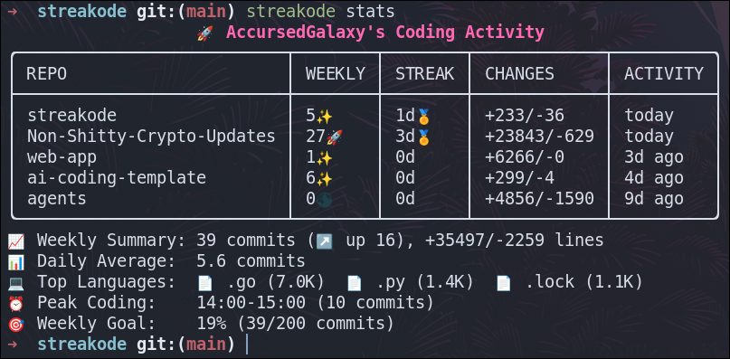

# Streakode 🚀

[](https://github.com/AccursedGalaxy/streakode/releases)
[](https://goreportcard.com/report/github.com/AccursedGalaxy/streakode)
[](https://github.com/AccursedGalaxy/streakode/blob/main/LICENSE.md)

Streakode is a powerful Git activity tracker that helps developers monitor their coding streaks, commit patterns, and project engagement. It provides insightful statistics about your coding habits across multiple repositories, with support for different profiles (e.g., work and personal projects).



## Features ✨

- 📊 Enhanced commit tracking and statistics
  - Detailed weekly/monthly commit patterns
  - Code changes tracking (+/-) per repository
  - Language statistics and peak coding hours
  - Customizable activity indicators
- 🎨 Highly configurable display options
  - Customizable table layouts and styles
  - Color themes support
  - Multiple insight views
- 🔄 Smart caching system
  - Efficient repository scanning
  - Selective cache updates
  - Version-aware cache management
- 🎯 Advanced goal tracking
  - Weekly commit goals
  - Progress visualization
  - Customizable thresholds
- 👤 Profile management
  - Work/personal separation
  - Profile-specific configurations
  - Easy profile switching

## Installation 🛠️

Proper Installation Flow Coming Soon.
-> Including automatic config file creation and more.

### From Releases

Download the latest release for your platform from the [releases page](https://github.com/AccursedGalaxy/streakode/releases).

### Building from Source

```bash
git clone https://github.com/AccursedGalaxy/streakode.git
cd streakode
make install
```

## Configuration 📝

Create a configuration file at `~/.streakodeconfig.yaml`:

```yaml
author: "AccursedGalaxy"
dormant_threshold: 31  # days
scan_directories:
  - "~/github"
scan_settings:
  excluded_patterns:
    - "node_modules"
    - "dist"
    - ".git"
    - "vendor"
    - "build"
    - ".cache"
  excluded_paths:
    - "/home/user/Downloads/"
refresh_interval: 60   # Minutes

display_stats:
  show_welcome_message: true
  show_active_projects: true
  show_insights: true
  max_projects: 10

  table_style:
    use_table_header: true
    style: "rounded" # default, rounded, bold, light, double
    options:
      draw_border: true
      separate_columns: true # doesnt work :(
      separate_header: true
      separate_rows: false

  activity_indicators:
    high_activity: "🚀"
    normal_activity: "✨"
    no_activity: "🌑"
    streak_record: "🏅"
    active_streak: "🔥"

  thresholds:
    high_activity: 10

  insight_settings:
    top_languages_count: 3
    show_daily_average: true
    show_top_languages: true
    show_peak_coding: true
    show_weekly_summary: true
    show_weekly_goal: true
    show_most_active: false # not showing when detailed stats is true (could remove)

goal_settings:
  weekly_commit_goal: 50

colors:
  header_color: "#FF69B4"

detailed_stats: true

language_settings:
  excluded_extensions:
    - ".md"
    - ".txt"
    - ".yaml"
    - ".json"
  excluded_languages:
    - "Markdown"
    - "Text"
    - "YAML"
    - "JSON"
  minimum_lines: 100
  language_display:
    go_display: "🔵 Go"
    python_display: "🐍 Python"
    lua_display: "🌙 Lua"
    javascript_display: "💛 JavaScript"
    typescript_display: "🔷 TypeScript"
    rust_display: "🦀 Rust"
    cpp_display: "💥 C++"
    c_display: "🌟 C"
    java_display: "☕ Java"
    ruby_display: "💎 Ruby"
    php_display: "🐘 PHP"
    html_display: "🌐 HTML"
    css_display: "🎨 CSS"
    shell_display: "🐚 Shell"
    default_display: "📄 File"  # Fallback icon for unspecified languages

show_dividers: false
```

## Usage 💻

### Basic Commands

```bash
# Show version
streakode --version
streakode version

# Check your Git author configuration
streakode author

# Show statistics
streakode stats

# Refresh repository cache
streakode cache reload

# Clear repository cache
streakode cache clean

# Switch profiles
streakode profile work    # Switch to work profile
streakode profile home    # Switch to home profile
streakode profile default # Switch to default profile
```

## Updating 🔄

Logic for updating is currently not implemented.

If you want to update, you can manually download the latest release from the [releases page](https://github.com/AccursedGalaxy/streakode/releases) and replace the current binary.

Or if you cloned the repository, you can pull the latest changes and build the project again.

```bash
git pull
make clean
make build
make install
```

## Uninstallation 🗑️

To completely remove Streakode from your system:

```bash
# Remove the binary
go clean -i github.com/AccursedGalaxy/streakode

# Remove configuration and cache files
rm ~/.streakodeconfig*.yaml    # Removes all config files including profiles
rm ~/.streakode*.cache         # Removes all cache files including profiles
rm ~/.streakode.state          # Removes the state file

# Single Command For All Files and Configs (Linux/MacOS)
rm /usr/local/bin/streakode && rm ~/.streakodeconfig* ~/.streakode*.cache ~/.streakode.state

# For Windows users (PowerShell):
Remove-Item "$env:USERPROFILE\.streakodeconfig*.yaml"
Remove-Item "$env:USERPROFILE\.streakode*.cache"
Remove-Item "$env:USERPROFILE\.streakode.state"
```

Note: If you installed Streakode from a release binary instead of `go install`, simply delete the binary and the configuration files as shown above.

## Contributing 🤝

Contributions are welcome! Please feel free to submit a Pull Request. For major changes, please open an issue first to discuss what you would like to change.

1. Fork the repository
2. Create your feature branch (`git checkout -b feature/AmazingFeature`)
3. Commit your changes (`git commit -m 'Add some AmazingFeature'`)
4. Push to the branch (`git push origin feature/AmazingFeature`)
5. Open a Pull Request

### Development Setup

```bash
# Clone the repository
git clone https://github.com/AccursedGalaxy/streakode.git

# Install dependencies
go mod download

# Build and install locally
make dev
```

---

## License 📄

This project is licensed under the MIT License - see the [LICENSE](LICENSE) file for details.

## Acknowledgments 🙏

- Thanks to all contributors who have helped shape Streakode
- Built with [Cobra](https://github.com/spf13/cobra) and [Viper](https://github.com/spf13/viper)

## Support 💖

If you find Streakode helpful, please consider:
- Giving it a ⭐ on GitHub
- Sharing it with others
- [Reporting issues](https://github.com/AccursedGalaxy/streakode/issues) if you find any bugs

---

Made with ❤️ by [AccursedGalaxy](https://github.com/AccursedGalaxy)
